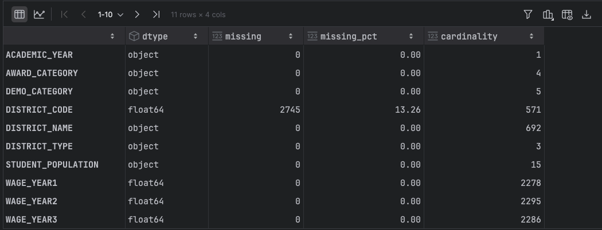
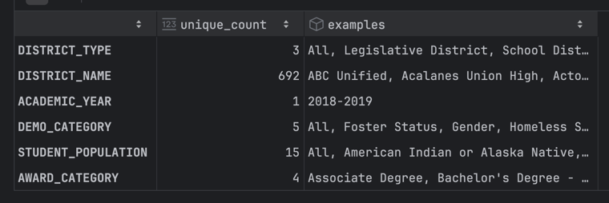
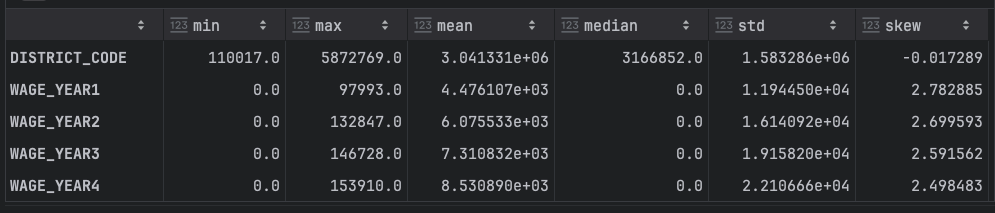
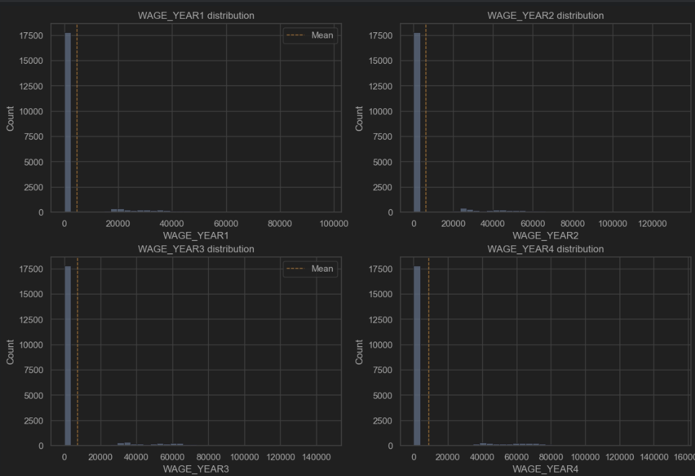
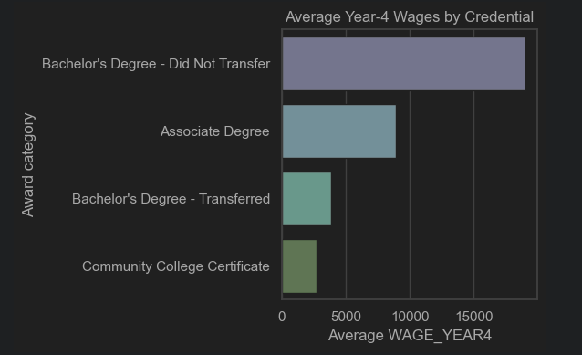
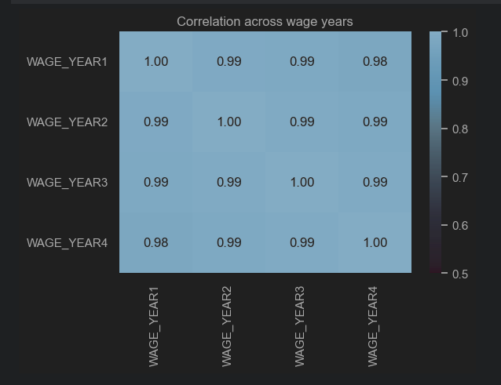
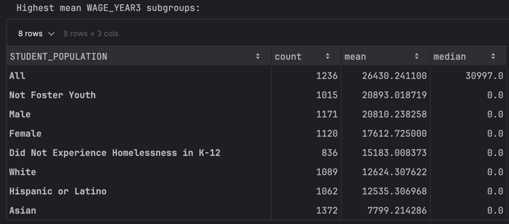
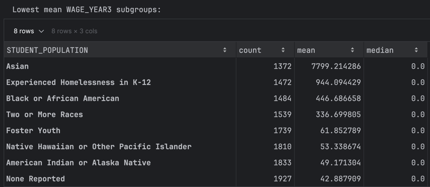
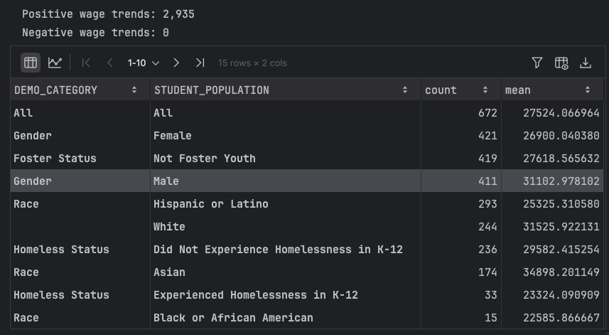
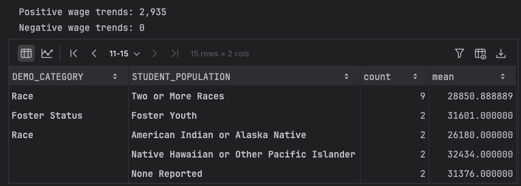

# x62-data-challenge-student-pathways

Repository for CS x62 Assignment 5 – Data Challenge 1. All analysis lives in the notebook `CS x62 - Assignment 5 - Data Challenge 1.ipynb`, and the trained model’s inference output is stored in `preds.csv`.

## 1.Data quality: For each feature (column), what is the data type? Is there any missing data?

### Data exploration

#### Data quality

> Only `DISTRICT_CODE` has missing values (13% of the rows). Every other column is complete.

## 2.Range: What are the unique values for each categorical column? What is the range of values of the numeric columns? Are the numeric column values normally distributed?
### Unique categorical values

- `DISTRICT_TYPE (3)`: `School District`, `Legislative District`, `All`.
- `DISTRICT_NAME (692)`: e.g., `Duarte Unified`, `Coronado Unified`, `Gilroy Unified`, `Pleasant Valley`, `Senate District 15`, `Adelanto Elementary`, `Assembly District 56`, `Klamath-Trinity Joint Unified`, `Modoc Joint Unified`, `Healdsburg Unified`, `Kings County Office of Education`, `Assembly District 11`, `Liberty Union High`, `Azusa Unified`, `Benicia Unified`, `Konocti Unified`, `SBE - Vista Springs Charter`, `Stone Corral Elementary`, `Santa Cruz County Office of Education`, `Del Norte County Unified` (total of 692 unique district/legislative names in the file).
- `DEMO_CATEGORY (5)`: `Race`, `Gender`, `Homeless Status`, `Foster Status`, `All`.
- `STUDENT_POPULATION (15)`: `None Reported`, `Black or African American`, `Did Not Experience Homelessness in K-12`, `American Indian or Alaska Native`, `Native Hawaiian or Other Pacific Islander`, `All`, `Two or More Races`, `Foster Youth`, `Female`, `White`, `Experienced Homelessness in K-12`, `Not Foster Youth`, `Male`, `Asian`, `Hispanic or Latino`.
- `AWARD_CATEGORY (4)`: `Associate Degree`, `Community College Certificate`, `Bachelor's Degree - Did Not Transfer`, `Bachelor's Degree - Transferred`.
- `ACADEMIC_YEAR (1)`: `2018-2019` only, so there is no temporal variation in this release.
### Range & Distribution Highlights

> Distributions are strongly right-skewed (medians at 0 for most wage fields).

## 3.Semantics: What is the meaning of the columns? Are any columns related to other columns? (If so, how?)
### Column semantics & relationships
- **District & cohort identifiers:** `DISTRICT_TYPE`, `DISTRICT_NAME`, and `DISTRICT_CODE` tie each record to a specific district or legislative region, while `ACADEMIC_YEAR` fixes the cohort (2018-2019 graduates in this release).
- **Demographic axis & subgroup:** `DEMO_CATEGORY` tells you which lens you're using (Race, Gender, Homeless Status, etc.), and `STUDENT_POPULATION` names the actual group within that lens-think "Race + Asian" or "Gender + Female." Each row is basically "one district, one subgroup, one award."
- **Credential information:** `AWARD_CATEGORY` distinguishes the credential earned. Bachelor's recipients-especially "Did Not Transfer"-show the highest average wages, while certificate earners trend lower.
- **Outcome timeline:** `WAGE_YEAR1`-`WAGE_YEAR4` capture subgroup wages for each of the first four years after award. These lagged wage features are highly correlated (rho > 0.95) and exhibit monotonic growth: `WAGE_YEAR4 >= WAGE_YEAR3 >= WAGE_YEAR2 >= WAGE_YEAR1` across the training rows.

#### Credential vs. wage evidence

> The bar chart confirms that Bachelor's degree earners (especially the "Did Not Transfer" pathway) have the highest `WAGE_YEAR4`, while certificate recipients sit at the lower end.

#### Wage correlation heatmap

> The heatmap quantifies the strong pairwise correlations among wage years, reinforcing why WAGE_YEAR3 (and earlier wages) dominate the feature importance story for predicting WAGE_YEAR4.

## Additional CS 562 answers
  
### 1. Which demographic shows the highest `WAGE_YEAR3`? Which demographic shows the lowest `WAGE_YEAR3`?

- Ignoring the catch-all `All` bucket and rows reported as `None Reported`, the strongest averages come from `Not Foster Youth` (~20.9K), `Male` (~20.8K), `Female` (~17.6K), and `Did Not Experience Homelessness in K-12` (~15.2K). On the low end, `American Indian or Alaska Native` (~49), `Native Hawaiian or Other Pacific Islander` (~53), `Foster Youth` (~62), and `Two or More Races` (~337) have the weakest means.

### 2. Are there any people with negative wage trends? Describe these people by their demographics.
- None observed. Every record satisfies `WAGE_YEAR4 >= WAGE_YEAR1`, so there are no negative trends to explain.
### 3. Are there any people with positive wage trends? Describe these people by their demographics.
- Yes. A total of 2,935 district/subgroup slices earn more in year 4 than in year 1 (average lift ≈ +28.6K). The main clusters are:
  - **All students:** `DEMO_CATEGORY = All`, `STUDENT_POPULATION = All` (672 records, +27.5K avg)
  - **Gender splits:** Female (421, +26.9K) and Male (411, +31.1K)
  - **Foster status:** `Not Foster Youth` (419, +27.6K) and `Foster Youth` (2, +31.6K)
  - **Race:** Hispanic or Latino (293, +25.3K), White (244, +31.5K), Asian (174, +34.9K), Black or African American (15, +22.6K), Two or More Races (9, +28.9K), American Indian or Alaska Native (2, +26.2K), Native Hawaiian or Other Pacific Islander (2, +32.4K), None Reported (2, +31.4K)
  - **Homeless status:** Did Not Experience Homelessness in K-12 (236, +29.6K) and Experienced Homelessness in K-12 (33, +23.3K)

#### Wage trend visuals

